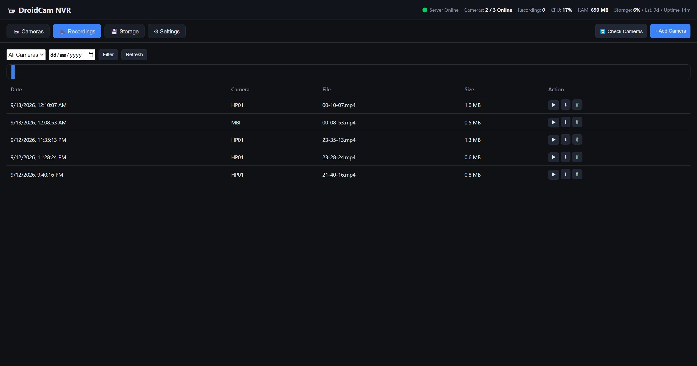
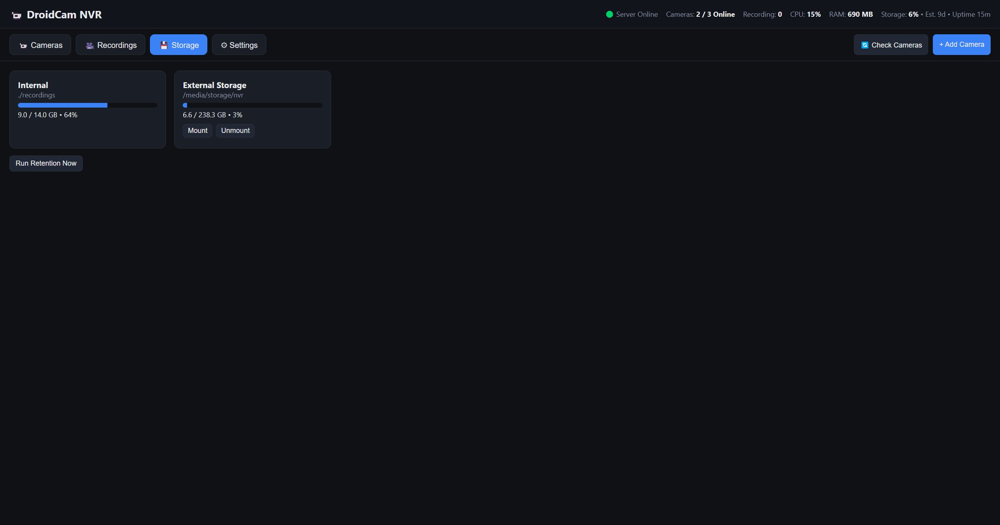
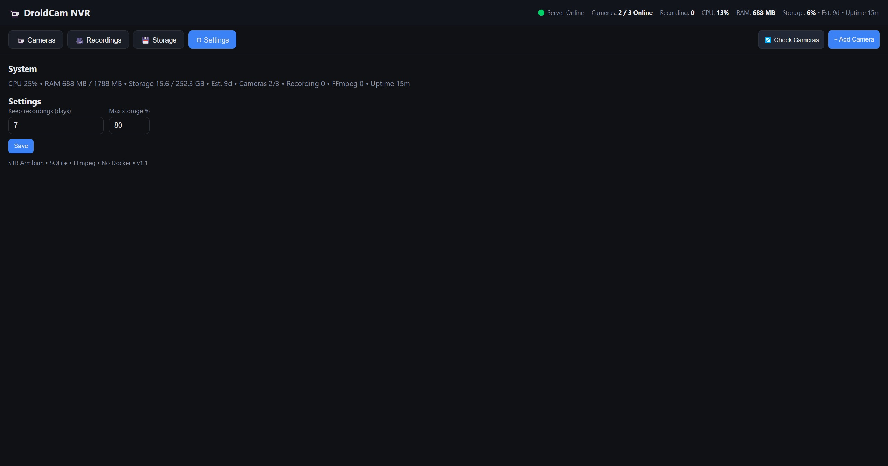

# Multi DroidCam NVR Dashboard

Lightweight NVR for multiple Android phones running **DroidCam Free** (`com.dev47apps.droidcam`) with **STB Armbian ARM64** as server. Live monitoring, segmented auto-recording, sequential playback — no Docker, no default transcoding.

> `Android (DroidCam) → WiFi/LAN → STB Armbian → NVR Server → Web Dashboard → Internal/External Storage`

## Screenshots

### Camera Management


### Recordings - Library & Playback


### Storage - Internal & External


### Settings - System Monitor


## Features

- **Multi-camera grid** + header `Server Online • Cameras 4/5 • Recording 3 • CPU/RAM/Storage`
- **Click → large viewer** + thumbnails + fullscreen, same page
- **Camera management** CRUD, enable/disable, test connection, rename, configurable URL (`http://IP:4747/mjpegfeed` or `/video`)
- **Stream Manager** single upstream, reconnect, MD5 freeze detection (60 frames), timeout
- **Live view** MJPEG proxy passthrough (no transcode), HLS/remux fallback
- **Recording** manual / continuous / schedule (dormant), `⏺ REC` button per camera
- **Segmented** `5 minutes` + `100 MB` → `recordings/cam01/2026/09/12/19-00-00.mp4` (not a single long file)
- **Stream copy** `H264` if source is H264, transcode `MJPEG→H264` via `libx264` (fallback `h264_v4l2m2m`) — single-client pipe sharing for DroidCam Free
- **Storage** internal `/media/storage/nvr`, external `/media/storage/nvr`, custom — Storage Manager + `df` stats
- **Recording library** filter by camera/date, `▶ Play ⬇ Download 🗑 Delete`, **continuous playback** + timeline
- **Retention** `7 days` + `80%` max storage → delete oldest, skip active file
- **System monitor** `/proc/stat`, `/proc/meminfo`, `statvfs`, SSE realtime
- **Deploy** `install.sh start.sh stop.sh update.sh` + `systemd droidcam-nvr.service` at `http://STB-IP:8080`

## Architecture

```
Camera Source → Stream Manager → ┬ Viewer (MJPEG proxy)
                                 └ Recorder (FFmpeg segment)
```

- 1 upstream per camera, shared to many viewers + recorder via pipe (DroidCam single-client fix)
- `MJPEG → JPEG → libx264 → segmented MP4` or `MJPEG copy → avi`
- `SSE /api/events` for camera/storage/system realtime

## Requirements

- STB Armbian ARM64, Node 20+, FFmpeg 7+, `node:sqlite` (built-in)
- Android phones with DroidCam Free, same 5GHz WiFi as STB

## Quick Start

```bash
git clone <repo> && cd Multi-DroidCam-Dashboard
./install.sh          # install Node, FFmpeg, npm deps, enable systemd
./start.sh            # or sudo systemctl start droidcam-nvr
# http://STB-IP:8080
```

Scripts:
- `install.sh` — deps + `systemctl enable`
- `start.sh` — `pm2` or `nohup` fallback
- `stop.sh` — stop + kill ffmpeg
- `update.sh` — `git pull` + restart

Systemd:
```bash
sudo cp droidcam-nvr.service /etc/systemd/system/
sudo systemctl daemon-reload && sudo systemctl enable --now droidcam-nvr
```

## Usage

1. **Cameras** → `+ Add Camera` enter `http://192.168.1.69:4747/mjpegfeed` (or `/video`, both supported)
2. `🔄 Check Cameras` → popup `✅ OK` → thumbnails appear instantly
3. Click card → large viewer, `⏺ REC` for manual, `⛶ Fullscreen`
4. **Recordings** → filter, `▶` sequential play, `⬇` download, click timeline segment
5. **Storage** → view `Internal/External`, `Mount/Unmount`, `Run Retention Now`
6. **Settings** → `Keep recordings` + `Max storage`

Recording modes:
- `manual` — button per camera
- `continuous` — always record when `recording ON`
- `schedule` — `22:00-06:00` + days (dormant, checked every 60s)

## REST API

```
GET    /api/cameras
POST   /api/cameras
PUT    /api/cameras/:id
DELETE /api/cameras/:id
GET    /api/cameras/:id/status
POST   /api/cameras/:id/test
POST   /api/cameras/:id/record/start
POST   /api/cameras/:id/record/stop
GET    /api/cameras/:id/stream           # MJPEG proxy
GET    /api/cameras/:id/schedules
POST   /api/cameras/:id/schedules

GET    /api/recordings?camera_id=&date=&page=&limit=
GET    /api/recordings/:id
DELETE /api/recordings/:id
GET    /api/recordings/:id/stream

GET    /api/storage
POST   /api/storage/:id/mount
POST   /api/storage/:id/unmount
GET    /api/system/status               # CPU/RAM/storage/cameras/ffmpeg + Est. remaining
GET    /api/system/settings
PUT    /api/system/settings
GET    /api/events                      # SSE
```

## Directory

```
recordings/cam01/2026/09/12/19-00-00.mp4
data/nvr.db
public/ (grid, viewer, timeline)
src/lib/{db,streamManager,recorder,storageManager,systemMonitor}
```

## Build Phases

Phase 1 CRUD+grid, Phase 2 FFmpeg segment, Phase 3 storage/playback, Phase 4 retention/reconnect, Phase 5 monitor/systemd — all done.

## License

MIT — STB Armbian, no Docker, SQLite, FFmpeg stream-copy priority.
