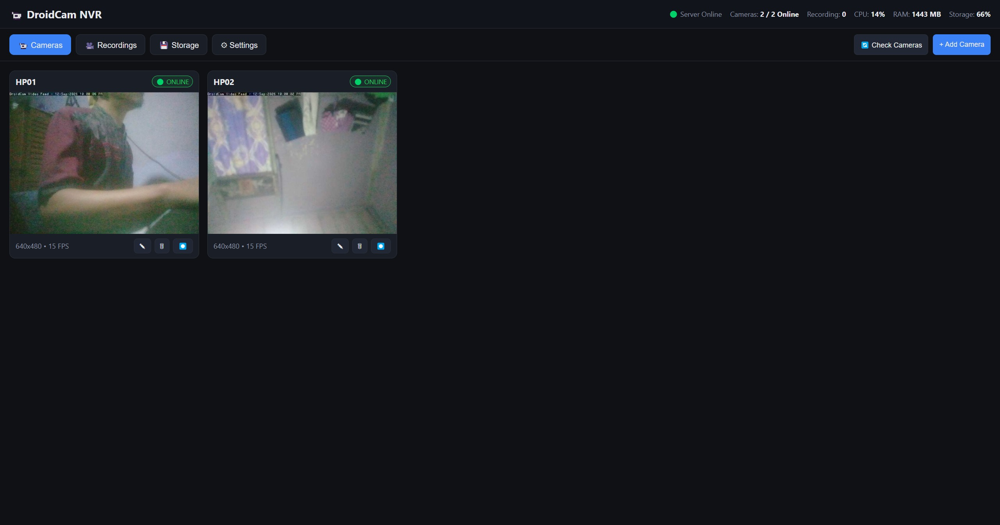

# Multi DroidCam NVR Dashboard



Mini NVR hemat resource untuk beberapa HP Android **DroidCam Free** (`com.dev47apps.droidcam`) dengan **STB Armbian ARM64** sebagai server. Live monitoring, recording segmented otomatis, playback berurutan — tanpa Docker, tanpa transcoding default.

> `Android (DroidCam) → WiFi/LAN → STB Armbian → NVR Server → Web Dashboard → Internal/External Storage`

## Fitur

- **Multi-camera grid** + header `Server Online • Cameras 4/5 • Recording 3 • CPU/RAM/Storage`
- **Click → large viewer** + thumbnail + fullscreen, tetap di halaman sama
- **Camera management** CRUD, enable/disable, test connection, rename, URL configurable (`http://IP:4747/mjpegfeed` atau `/video`)
- **Stream Manager** single upstream, reconnect, MD5 freeze detection (60 frame), timeout
- **Live view** MJPEG proxy passthrough (tanpa transcode), HLS/remux fallback
- **Recording** manual / continuous / schedule (dormant), tombol `⏺ REC` per kamera
- **Segmented** `5 menit` + `100 MB` → `recordings/cam01/2026/09/12/19-00-00.mp4` (bukan 1 file panjang)
- **Stream copy** `H264` jika source H264, transcode `MJPEG→H264` via `libx264` (fallback `h264_v4l2m2m`) — single-client pipe sharing untuk DroidCam Free
- **Storage** internal `/mnt/nvr`, external SSD `/media/ssd/nvr`, custom — Storage Manager + `df` stats
- **Recording library** filter camera/date, `▶ Play ⬇ Download 🗑 Delete`, **continuous playback** + timeline
- **Retention** `7 hari` + `80%` max storage → hapus oldest, skip file aktif
- **System monitor** `/proc/stat`, `/proc/meminfo`, `statvfs`, SSE realtime
- **Deploy** `install.sh start.sh stop.sh update.sh` + `systemd droidcam-nvr.service` di `http://STB-IP:8080`

## Arsitektur

```
Camera Source → Stream Manager → ┬ Viewer (MJPEG proxy)
                                 └ Recorder (FFmpeg segment)
```

- 1 upstream per kamera, dishare ke banyak viewer + recorder via pipe (DroidCam single-client fix)
- `MJPEG → JPEG → libx264 → segmented MP4` atau `MJPEG copy → avi`
- `SSE /api/events` untuk camera/storage/system realtime

## Requirements

- STB Armbian ARM64, Node 20+, FFmpeg 7+, `better-sqlite3` via `node:sqlite` (built-in)
- HP Android DroidCam Free, WiFi 5GHz sama dengan STB

## Quick Start

```bash
git clone <repo> && cd Multi-DroidCam-Dashboard
./install.sh          # install Node, FFmpeg, npm deps, enable systemd
./start.sh            # atau sudo systemctl start droidcam-nvr
# http://STB-IP:8080
```

Scripts:
- `install.sh` — deps + `systemctl enable`
- `start.sh` — `pm2` atau `nohup` fallback
- `stop.sh` — stop + kill ffmpeg
- `update.sh` — `git pull` + restart

Systemd:
```bash
sudo cp droidcam-nvr.service /etc/systemd/system/
sudo systemctl daemon-reload && sudo systemctl enable --now droidcam-nvr
```

## Penggunaan

1. **Cameras** → `+ Add Camera` isi `http://192.168.1.69:4747/mjpegfeed` (atau `/video`, keduanya support)
2. `🔄 Check Cameras` → popup `✅ OK` → thumb langsung tampil (tanpa klik)
3. Klik card → large viewer, `⏺ REC` untuk manual, `⛶ Fullscreen`
4. **Recordings** → filter, `▶` play berurutan, `⬇` download, timeline klik segment
5. **Storage** → lihat `Internal/External`, `Run Retention Now`
6. **Settings** → `Keep recordings` + `Max storage`

Mode recording:
- `manual` — tombol per kamera
- `continuous` — selalu rekam saat `recording ON`
- `schedule` — `22:00-06:00` + hari (dormant, cek tiap 60s)

## REST API

```
GET    /api/cameras
POST   /api/cameras
PUT    /api/cameras/:id
DELETE /api/cameras/:id
GET    /api/cameras/:id/status
POST   /api/cameras/:id/test
POST   /api/cameras/:id/record/start
POST   /api/cameras/:id/record/stop
GET    /api/cameras/:id/stream           # MJPEG proxy
GET    /api/cameras/:id/schedules
POST   /api/cameras/:id/schedules

GET    /api/recordings?camera_id=&date=&page=&limit=
GET    /api/recordings/:id
DELETE /api/recordings/:id
GET    /api/recordings/:id/stream

GET    /api/storage
GET    /api/system/status               # CPU/RAM/storage/cameras/ffmpeg
GET    /api/system/settings
PUT    /api/system/settings
GET    /api/events                      # SSE
```

## Direktori

```
recordings/cam01/2026/09/12/19-00-00.mp4
data/nvr.db
public/ (grid, viewer, timeline)
src/lib/{db,streamManager,recorder,storageManager,systemMonitor}
```

## Build Phase

Phase 1 CRUD+grid, Phase 2 FFmpeg segment, Phase 3 storage/playback, Phase 4 retention/reconnect, Phase 5 monitor/systemd — semua done.

## Lisensi

MIT — STB Armbian, no Docker, SQLite, FFmpeg stream-copy priority.
